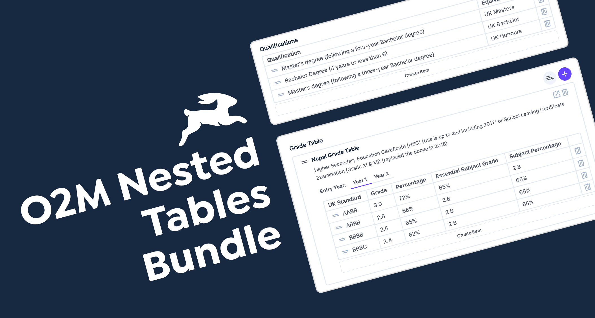

# O2M Tables and Nested Tables Bundle

Visualise content from a o2m relation as a table with the ability to create, edit, delete and rearrange data. If you have a nested table (o2m inside another o2m), this will show the nested table inside draggable elements as well as a title and description.




## Requirements
- Directus 11.1.2
- O2M Relation with another table

## Installation

```
npm i https://<SERVICE_ACCOUNT>:<ACCESS_TOKEN>@github.com/abertay-university/directus-o2m-nested-tables-bundle.git
```